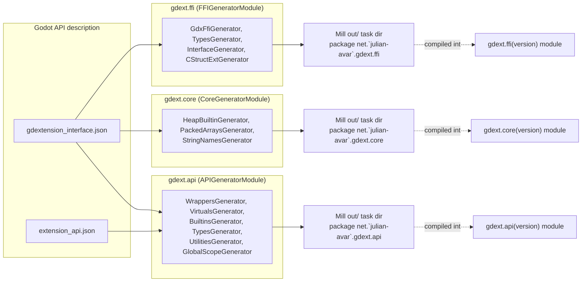

# Architecture Overview

This binding is split into modules along the same boundary godot-rust's `gdext` uses for its
Cargo crates: a zero-dependency raw C-ABI layer, a hand-written runtime on top of it, generated
idiomatic bindings on top of that, and a thin facade users actually depend on. The names differ
(Scala/Mill modules instead of Cargo crates, our own terms in a few places), but the boundaries —
and the reason they exist — are the same: each layer should only know about the layer directly
below it, so it's always clear which file is "raw FFI", which is "framework", which is
"generated API", and which is "user-facing facade".

`gdext.ffi`, `gdext.core`, and `gdext.api` are each a `Cross.Module[String]`, built once per
supported Godot version (`4.5.0`, `4.6.1`, `4.7.0` today — see `Config.godotVersions`). Codegen for
all three is wired directly into the build as Mill `generatedSources` tasks, so it reruns
automatically whenever the corresponding module compiles — there is no manual "run the generator"
step, and generated output is never checked into `src/`.

## Module map

| Module | Package | Role | Rust gdext analogue |
|---|---|---|---|
| [`gdext.ffi`](../gdext/ffi/README.md) | `com.\`julianavar\`.gdext.ffi` | Raw C-ABI bindings generated straight from `gdextension_interface.json` via the `FFIGeneratorModule` trait. Zero dependency on anything else in the binding; entirely generated, nothing checked in. | `godot-ffi` |
| [`gdext.core`](../gdext/core/README.md) | `com.\`julianavar\`.gdext.core` | Hand-written framework on top of `ffi`: object model (`Gd[T]`, `GodotObject`), class registration, variant marshalling, Zones, signals. The `CoreGeneratorModule` trait additionally emits a few mechanically-generated files at compile time (heap builtins, packed array extensions, string-name cache) that need `gdext.core` types. | `godot-core` (the hand-written parts: `obj`, `registry`, `meta`, `signal`, `init`) |
| [`gdext.api`](../gdext/api/README.md) | `com.\`julianavar\`.gdext.api` | Generated idiomatic Scala for every Godot class, builtin, and utility function (via `APIGeneratorModule`), merged with the hand-written `gdext.api.*` facade every game class imports, plus the editor-plugin base class and the `ScalaScript` language integration that lets `.scala` files be used as Godot scripts directly. | `godot-core` (the generated parts, produced via `build.rs` rather than a separate module) + the `godot` facade crate |
| [`gdext.generator-module-mill-plugin`](../gdext/generator-module-mill-plugin/README.md) | `com.\`julianavar\`.gdext.godotscalanativelib` | Build-time only. Supplies the `FFIGeneratorModule`/`CoreGeneratorModule`/`APIGeneratorModule` traits mixed into `ffi`/`core`/`api` above; not a dependency of any runtime module. | `godot-codegen` |
| `gdext` (top-level, per version) | — | Aggregates `api` + `core` (which pulls in `ffi` transitively) into the single dependency examples and user projects consume. | — |
| `gdext.mill-plugin` (artifact `gdext-mill-plugin`) | `com.\`julianavar\`.gdext.godotscalanativelib` | The published Mill plugin: supplies `GodotScalaNativeModule` (generated registration/entry-point scanning, `buildExtension`) to consumer `build.mill` files, e.g. every `examples/*` project. | — |

`examples/*` and user projects depend on `gdext-mill-plugin` (for the build-time
`GodotScalaNativeModule` trait) and `gdext` (for the runtime facade), resolved from `~/.ivy2/local`
via `just publishLocal`. Nothing outside `gdext.core` should need to import `gdext.ffi` directly —
see [`gdext/api/src/.../lowlevel.scala`](../gdext/api/src/com/julianavar/gdext/api/lowlevel.scala)
for the one sanctioned escape hatch (library/plugin authors who need raw FFI access).

## Build-time data flow

`FFIGeneratorModule`, `CoreGeneratorModule`, and `APIGeneratorModule` are independent Mill tasks
that each read Godot's API description JSON for one Godot version and write Scala source trees
into that task's own `out/` directory. `gdext.core`'s generated sources depend on `gdext.ffi`
having compiled first (ordinary module dependency, not a manual ordering step), and
`gdext.api`'s generator emits code that references `gdext.core` types, so `gdext.api` depends on
both.

## Runtime data flow

Two directions matter: outbound calls from user code into the engine, and inbound calls from the
engine into user code (virtual method overrides, signal callbacks).

```mermaid
flowchart TB
    subgraph "Outbound: user code calls the engine"
        USER["User @gdclass code\n(e.g. node.moveAndSlide())"]
        FACADE["gdext.api facade\n(annotations, Register, Gd[T])"]
        WRAP["gdext.api generated wrapper\n(Node3D.moveAndSlide, idiomatic Scala)"]
        MARSHAL["gdext.core Ptrcall/VariantTypeclasses\n(marshals Scala values to Variant/ptr args)"]
        RAWFFI["gdext.ffi function pointer\n(GdxFfi.objectMethodBindCall, ...)"]
        ENGINE["Godot engine (C++)"]
        USER --> FACADE --> WRAP --> MARSHAL --> RAWFFI --> ENGINE
    end

    subgraph "Inbound: engine calls back into Scala"
        ENGINE2["Godot engine fires a virtual\nmethod or signal"]
        CALLBACK["gdext.ffi extern callback\n(class_call_virtual, instance_create2 binding)"]
        DISPATCH["gdext.core dispatch trampoline\n(ClassRegistrar.godotPtrMap lookup,\nVirtualEntry.dispatch, wraps call in Zone)"]
        VIRT["gdext.api {Class}Virtuals trait\n(typed _ready/_process/... entries)"]
        OVERRIDE["User's override\n(e.g. override def ready(): Unit = ...)"]
        ENGINE2 --> CALLBACK --> DISPATCH --> VIRT --> OVERRIDE
    end
```

Outbound calls flow strictly downward through the layers (facade → generated → core → ffi →
engine); inbound calls flow strictly upward (ffi → core → generated → user). Neither direction
ever skips a layer — e.g. `gdext.api` wrappers never call `gdext.ffi` directly, they go through
`gdext.core`'s marshalling and ptrcall helpers.

## See also

- [`gdext/README.md`](../gdext/README.md) — build/compile pipeline, per-module known issues
- [Two ownership systems](01-two-ownership-systems.md) — why there are two parallel memory managers (Scala GC + Godot refcount), which motivates the `core`/`ffi` split
- [Class registration lifecycle](07-class-registration-lifecycle.md) — the compile-time scan and run-time init side of the outbound flow above
- [Generated virtual dispatch tables](13-generated-virtual-dispatch.md) — the `VirtualEntry`/`{Class}Virtuals` mechanics behind the inbound flow above
