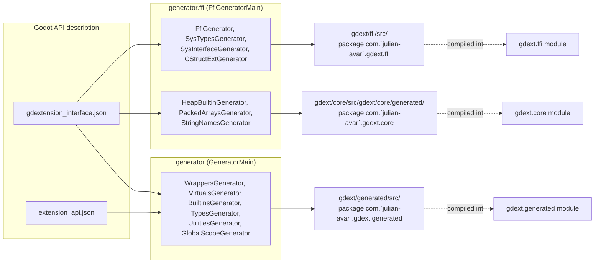

# Architecture Overview

This binding is split into modules along the same boundary godot-rust's `gdext` uses for its
Cargo crates: a zero-dependency raw C-ABI layer, a hand-written runtime on top of it, generated
idiomatic bindings on top of that, and a thin facade users actually depend on. The names differ
(Scala/Mill modules instead of Cargo crates, our own terms in a few places), but the boundaries —
and the reason they exist — are the same: each layer should only know about the layer directly
below it, so it's always clear which file is "raw FFI", which is "framework", which is
"generated API", and which is "user-facing facade".

## Module map

| Module | Package | Role | Rust gdext analogue |
|---|---|---|---|
| [`gdext.ffi`](../gdext/ffi/README.md) | `gdext.ffi` | Raw C-ABI bindings generated straight from `gdextension_interface.json`. Zero dependency on anything else in the binding. | `godot-ffi` |
| [`gdext.core`](../gdext/core/README.md) | `gdext.core` | Hand-written framework on top of `ffi`: object model (`Gd[T]`, `GodotObject`), class registration, variant marshalling, Zones, signals. A few mechanically-generated files that need `gdext.core` types live in `core/src/gdext/core/generated/` — same package, separated into their own folder so they're visibly generator output. | `godot-core` (the hand-written parts: `obj`, `registry`, `meta`, `signal`, `init`) |
| [`gdext.generated`](../gdext/generated/README.md) | `gdext.generated` | Generated idiomatic Scala for every Godot class, builtin, and utility function — what game code actually imports. | `godot-core` (the generated parts, produced via `build.rs` rather than a separate module) |
| [`gdext.generator.ffi`](../gdext/generator/ffi/README.md) | `gdext.generator.ffi` | Build-time tool. Reads `gdextension_interface.json` only; emits `gdext.ffi` plus the core-layer generated files. | `godot-codegen` (the sys-facing half) |
| [`gdext.generator`](../gdext/generator/README.md) | `gdext.generator` | Build-time tool. Reads both API JSONs; emits `gdext.generated`. | `godot-codegen` (the api-facing half) |
| `gdext` (facade) | `gdext`, `gdext.editor`, `gdext.scala`, `gdext.godot` | The `gdext.api.*` re-export surface every game class imports, plus the editor-plugin base class and the `ScalaScript` language integration that lets `.scala` files be used as Godot scripts directly. | `godot` (the facade crate) |

`examples/*` and user projects depend on the facade module (`gdext`), which transitively pulls in
`core`, `generated`, and `ffi`. Nothing outside `gdext.core` should need to import `gdext.ffi`
directly — see [`gdext/src/gdext/lowlevel.scala`](../gdext/src/gdext/lowlevel.scala) for the one
sanctioned escape hatch (library/plugin authors who need raw FFI access).

## Build-time data flow

The two generators are independent tools that both read Godot's API description JSON and write
Scala source. `generator.ffi` must run before `generator` because the api-layer generator emits
code that references `gdext.core` types, some of which (the heap builtins, packed array
extensions, string-name cache) are themselves produced by `generator.ffi`.

## Runtime data flow

Two directions matter: outbound calls from user code into the engine, and inbound calls from the
engine into user code (virtual method overrides, signal callbacks).

```mermaid
flowchart TB
    subgraph "Outbound: user code calls the engine"
        USER["User @gdclass code\n(e.g. node.moveAndSlide())"]
        FACADE["gdext.api facade\n(annotations, Register, Gd[T])"]
        WRAP["gdext.generated wrapper\n(Node3D.moveAndSlide, idiomatic Scala)"]
        MARSHAL["gdext.core Ptrcall/VariantTypeclasses\n(marshals Scala values to Variant/ptr args)"]
        RAWFFI["gdext.ffi function pointer\n(GdxFfi.objectMethodBindCall, ...)"]
        ENGINE["Godot engine (C++)"]
        USER --> FACADE --> WRAP --> MARSHAL --> RAWFFI --> ENGINE
    end

    subgraph "Inbound: engine calls back into Scala"
        ENGINE2["Godot engine fires a virtual\nmethod or signal"]
        CALLBACK["gdext.ffi extern callback\n(class_call_virtual, instance_create2 binding)"]
        DISPATCH["gdext.core dispatch trampoline\n(ClassRegistrar.godotPtrMap lookup,\nVirtualEntry.dispatch, wraps call in Zone)"]
        VIRT["gdext.generated {Class}Virtuals trait\n(typed _ready/_process/... entries)"]
        OVERRIDE["User's override\n(e.g. override def _ready(): Unit = ...)"]
        ENGINE2 --> CALLBACK --> DISPATCH --> VIRT --> OVERRIDE
    end
```

Outbound calls flow strictly downward through the layers (facade → generated → core → ffi →
engine); inbound calls flow strictly upward (ffi → core → generated → user). Neither direction
ever skips a layer — e.g. `gdext.generated` wrappers never call `gdext.ffi` directly, they go
through `gdext.core`'s marshalling and ptrcall helpers.

## See also

- [`gdext/README.md`](../gdext/README.md) — build/compile pipeline, per-module known issues
- [Two ownership systems](01-two-ownership-systems.md) — why there are two parallel memory managers (Scala GC + Godot refcount), which motivates the `core`/`ffi` split
- [Class registration lifecycle](07-class-registration-lifecycle.md) — the compile-time scan and run-time init side of the outbound flow above
- [Generated virtual dispatch tables](13-generated-virtual-dispatch.md) — the `VirtualEntry`/`{Class}Virtuals` mechanics behind the inbound flow above
