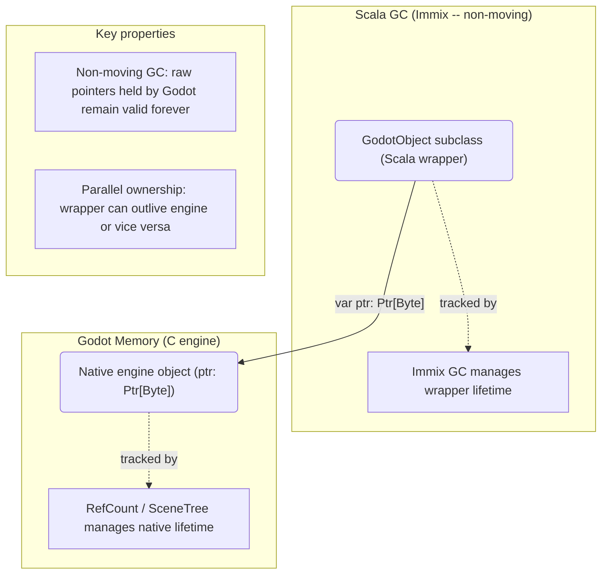
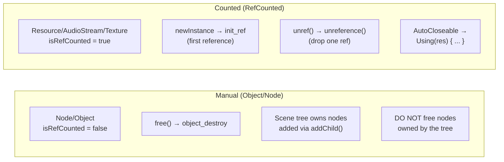
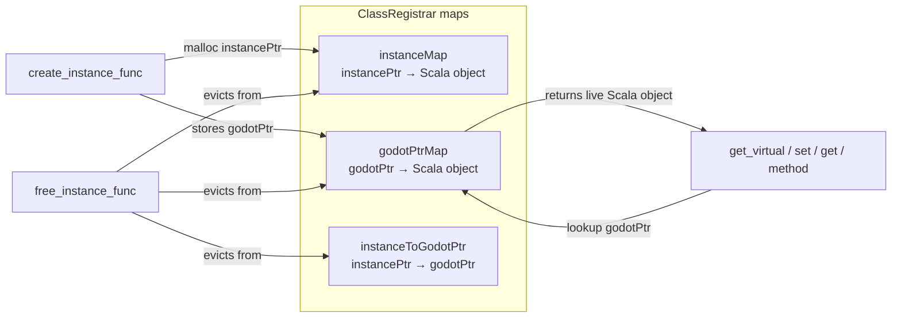

# Two Parallel Ownership Systems

The binding maintains **two independent memory managers** running in parallel. Every Godot object has
both a Scala wrapper (tracked by Scala Native's Immix GC) and a native engine object (tracked by
Godot's refcount / scene tree).

## Two Lifetime Regimes

Selection is per-class via `GodotClass[T].isRefCounted`:

## Identity Preservation

When Godot calls back into Scala (virtual dispatch, property get/set), the `ClassRegistrar`
maintains a `godotPtrMap` so the **same Scala instance** is returned for a given engine pointer:

## Key Rule

> **Scala GC manages the wrapper; you manage the engine object.**
>
> The wrapper `GodotObject` subclass holds a `var ptr: Ptr[Byte]` pointing to the native
> engine object. The Scala GC may collect the wrapper at any time (it is non-moving, so raw
> pointers are safe). But the native engine object persists until you explicitly call `free()`,
> `unref()`, or the scene tree destroys it.

## Files

- `gdext/core/src/com/julianavar/gdext/core/Gd.scala` — `Gd[T]` handle type
- `gdext/core/src/com/julianavar/gdext/core/GodotObject.scala` — base class with `ptr` field
- `gdext/core/src/com/julianavar/gdext/core/GodotClass.scala` — `isRefCounted` flag
- `gdext/core/src/com/julianavar/gdext/core/GdClassRegistry.scala` — registration storage
- `gdext/core/src/com/julianavar/gdext/core/ClassRegistrar.scala` — `instanceMap`, `godotPtrMap`
