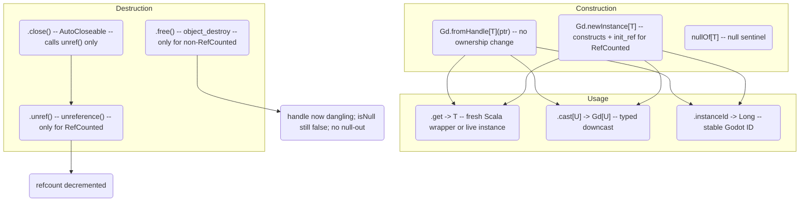
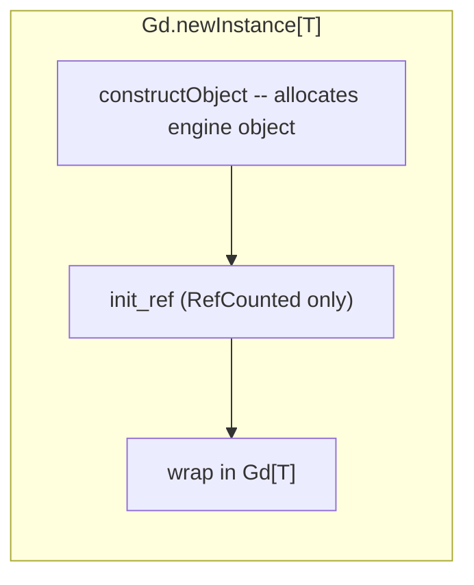

# `Gd[T]` Lifecycle — Free, Unref, and AutoCloseable

`Gd[T <: GodotObject]` is a typed handle wrapper that carries the raw engine pointer and
the `GodotClass[T]` evidence to know which lifetime regime applies.



## Bug: `close()` is a No-Op for Non-RefCounted

```scala
// Gd.scala:61
def close(): Unit = unref()   // calls unref() which checks isRefCounted
```

`close()` only calls `unref()`, which is a no-op for manually-managed objects (Node subclasses).
`Using(res) { ... }` does **NOT** free manually-managed handles. The user must call `.free()`
explicitly.

**Fix:** `close()` should dispatch:
```scala
def close(): Unit = if cls.isRefCounted then unref() else free()
```

## Bug: `free()` Does Not Null the Handle

After `free()`, `isNull` returns `false` and `objectPtr` returns the dangling pointer.
Calling any method on a freed object is undefined behavior.

**Fix:** Set `handle = null` in `free()`. But `handle` is a `val` — needs to become a `var`.

## Construction Details

| Method | RefCounted | Non-RefCounted |
|--------|-----------|----------------|
| `newInstance` | `constructObject` + `init_ref` | `constructObject` only |
| `fromHandle` | wraps ptr with no refcount change | wraps ptr with no ownership |
| `nullOf` | creates Gd with null handle | creates Gd with null handle |



## Null Safety

```scala
var target: Player = nullOf   // Gd[Player] with null handle
target.isNull                // true
target.get                   // throws NullPointerException
target.free()                // no-op
target.unref()               // no-op
```

## Files

- `gdext/core/src/com/julian-avar/gdext/core/Gd.scala` — `Gd[T]` class with `free()`, `unref()`, `close()`, `cast`
- `gdext/core/src/com/julian-avar/gdext/core/GodotClass.scala` — `isRefCounted`, `wrap`, `derived` macro
