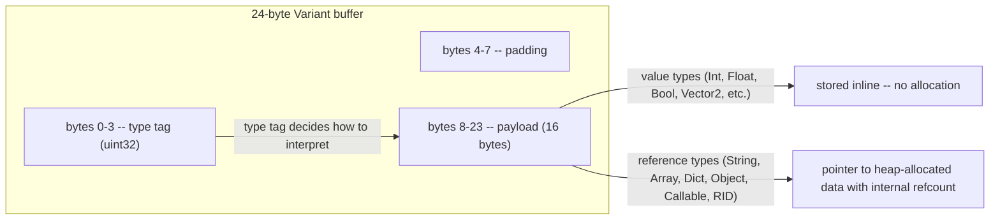
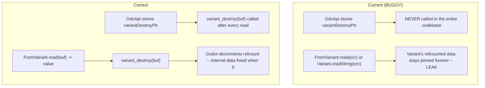
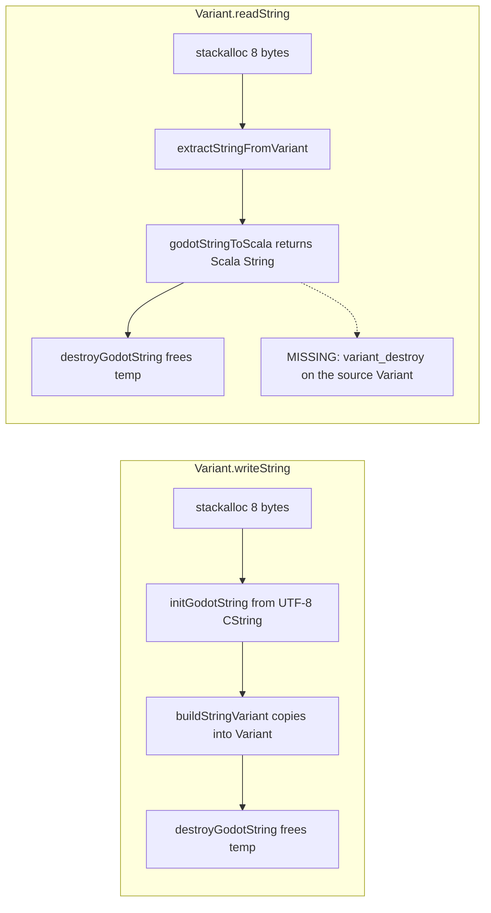

# Variant Lifecycle — The Root Cause of All Leaks

A Godot `Variant` is a 24-byte tagged union. It is the universal marshalling format for
signals, properties, method arguments, and collection elements. **Every read from a Variant
must be paired with a `variant_destroy` call**, or the Variant's internal reference-counted
data leaks.

## Variant Memory Layout

## The Missing `variant_destroy` Call

## What Leaks

Every call site that reads from a Variant without destroying it leaks for
reference-counted types:

| Call site | File | Type leaked |
|-----------|------|-------------|
| `GdArray.apply(i)` | `GdArray.scala:59` | Array element (Variant) |
| `GdArray.indexOf(v)` | `GdArray.scala:116` | Variant buffer |
| `GdArray.contains(v)` | `GdArray.scala:101` | Variant buffer |
| `GdDict.get(k)` | `GdDict.scala:73-75` | Dict value (Variant) |
| `GdDict.has(k)` | `GdDict.scala:53` | Variant buffer |
| `GdDict.foreach` | `GdDict.scala:131-146` | N Variants per iteration |
| `GdArray.foreach` | `GdArray.scala:160-166` | N Variants per iteration |
| `Variant.readString` | `PropertyDescriptor.scala:141` | String Variant |
| `FromVariant.read` for String | `VariantTypeclasses.scala:90` | String Variant |
| `fromVariantGdArray.read` | `GdArray.scala:219-226` | Array handle (refcount) |

String operations in `Variant.readString` DO call `destroyGodotString` on the temporary
string buffer, but do NOT call `variant_destroy` on the source Variant `p`.

## String Variant Lifetime

## Files

- `gdext/core/src/com/julian-avar/gdext/core/GdxApi.scala:213` — `variantDestroyPtr` stored but never called
- `gdext/core/src/com/julian-avar/gdext/core/PropertyDescriptor.scala:141-149` — `Variant.readString`
- `gdext/core/src/com/julian-avar/gdext/core/VariantTypeclasses.scala` — `FromVariant` implementations
