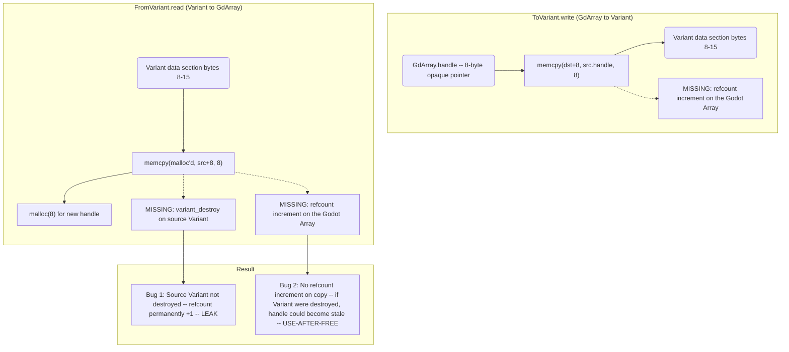
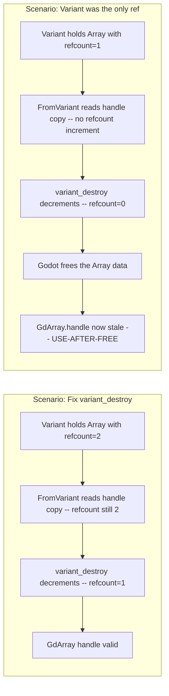
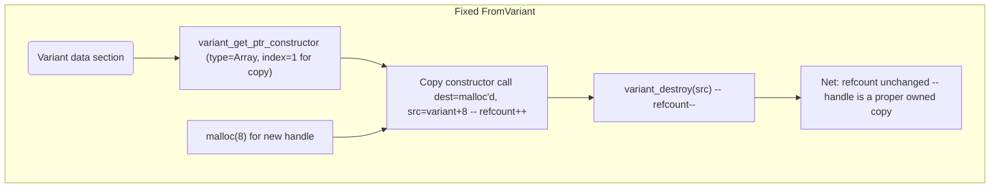
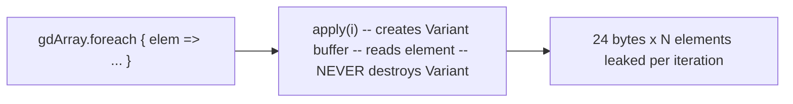

# GdArray / GdDict Refcounting — Use-After-Free Risk

Godot's `Array` and `Dictionary` are reference-counted heap types. Their 8-byte handle
is an opaque pointer to internally refcounted data. The current implementation copies
this handle with `memcpy` **without adjusting the refcount**, which creates two compound
bugs.

## The Broken Pattern



## Why It's Critical

If you fix the `variant_destroy` leak (Bug 1), you immediately trigger Bug 2:



## Correct Fix

Use Godot's copy constructors for Array and Dictionary, which properly increment
the refcount:



## `destroy()` Double-Free Bug

`GdArray.destroy()` and `GdDict.destroy()` call `free(handle)` unconditionally:

```scala
// GdArray.scala:183-185
def destroy(): Unit = if handle != null then
    GdxApi.destroyArray(handle)  // Godot destructor
    free(handle)                   // free the malloc'd buffer
```

This is correct **only if** the handle was allocated by `malloc` (i.e., created via `GdArray[A]()`
or `FromVariant.read`). If the GdArray was created via `fromHandle` (wrapping an engine-owned
handle), calling `free` is **undefined behavior**.

**Fix:** Track whether the handle is owned (malloc'd) or borrowed (fromHandle).

## `foreach` Variant Leak

Both `GdArray.foreach` and `GdDict.foreach` call `apply(i)` per element, which fills and leaks
a Variant for each access:



For an array of 1000 elements iterated once per frame at 60fps for 60 seconds:
1000 × 24 × 60 × 60 = **86 MB leaked**.

## Files

- `gdext/core/src/gdext/core/GdArray.scala` — `ToVariant`, `FromVariant`, `destroy`, `foreach`
- `gdext/core/src/gdext/core/GdDict.scala` — `ToVariant`, `FromVariant`, `destroy`, `foreach`
