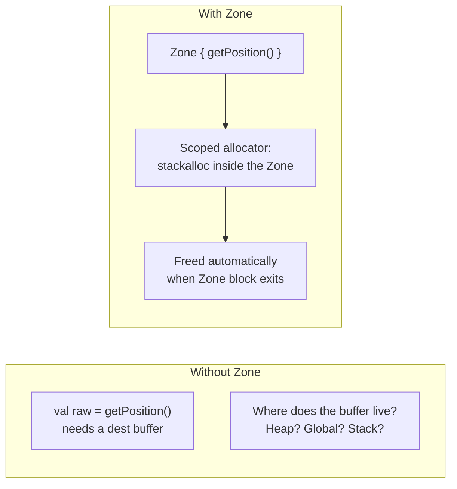
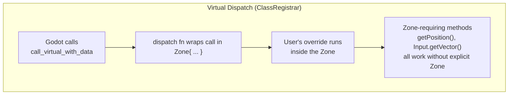
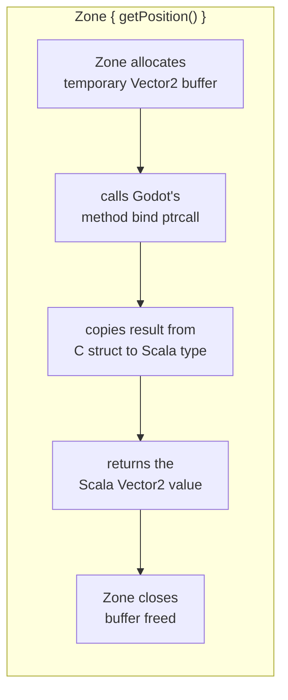

# Zone System — Stack Allocation for Value Types

Godot's value-type builtins (`Vector2`, `Vector3`, `Color`, `Transform2D`, etc.) are
opaque C structs in memory. Some generated engine methods **return** these by value into
a caller-provided buffer. The `Zone` mechanism provides a scoped memory arena for these
temporary allocations.

## What Zone Solves

```scala
// These methods need a stack buffer for the return value:
val pos = Zone { getPosition() }

// Zone provides an implicit allocator for the duration of the block.
// The buffer is freed when the block exits.
```



## Automatic Zone in Virtual Dispatch

Every virtual method override (`_ready`, `_process`, etc.) is wrapped in a Zone
automatically by the dispatch trampoline:

```scala
@gdclass class PlayerSc extends CharacterBody2D:
    override def physicsProcess(delta: Double): Unit =
        // Zone is already active — no manual Zone block needed:
        val dir = Input.getVector("left", "right", "up", "down")
        velocity = dir * speed.toFloat
        moveAndSlide()
```



## Zone-Requiring vs Non-Zone APIs

| Pattern | Example | Zone needed? |
|---------|---------|-------------|
| Property setter | `velocity = dir * speed` | No (sets on self) |
| Property getter | `getPosition()` | Yes (returns via buffer) |
| Convenience getter | `position` | No (stack-allocates internally) |
| Singleton utility | `Input.getVector(...)` | No (uses Zone if inside virtual) |
| Method return (value type) | `someNode.getPosition()` | Yes, unless inside virtual |

## How Zone Works

Scala Native's `Zone` is a region-based allocator. Memory allocated via `stackalloc` inside
a Zone is valid until the Zone closes. The binding uses this to pass temporary buffers to
Godot's C API:



## Files

- `gdext/core/src/com/julianavar/gdext/core/ClassRegistrar.scala` — virtual dispatch trampoline creates Zone
- `gdext/core/src/com/julianavar/gdext/core/Ptrcall.scala` — `stackalloc` used for ptrcall args/ret buffers
- `gdext/core/src/com/julianavar/gdext/core/PropertyDescriptor.scala` — `Variant.readBuiltin`/`writeBuiltin`
