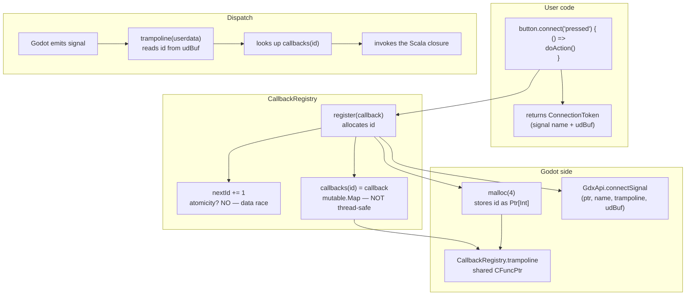
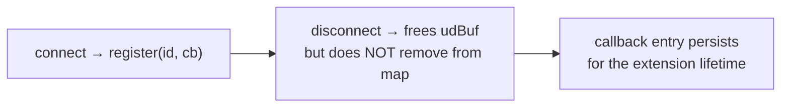
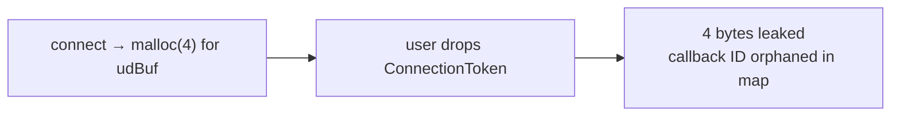
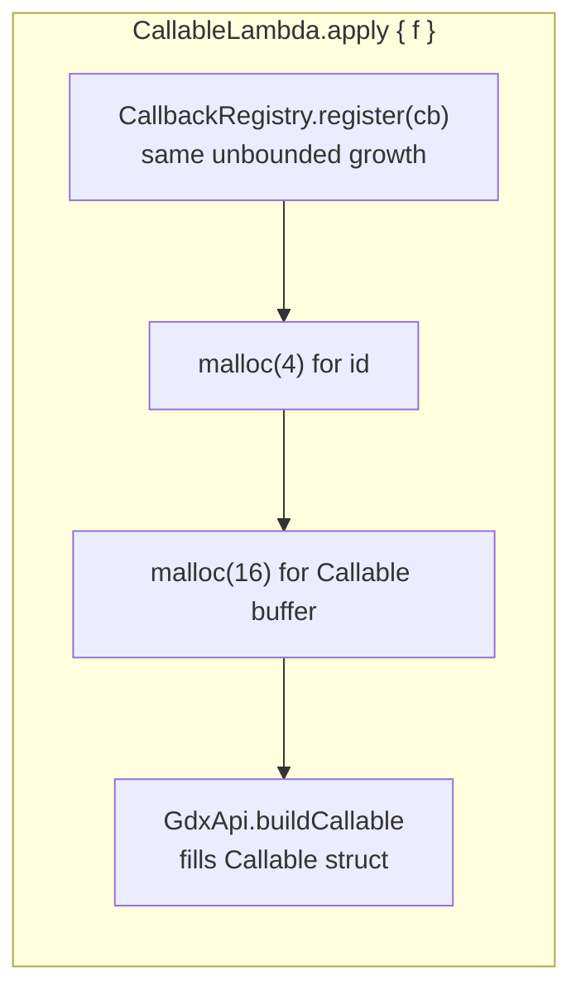
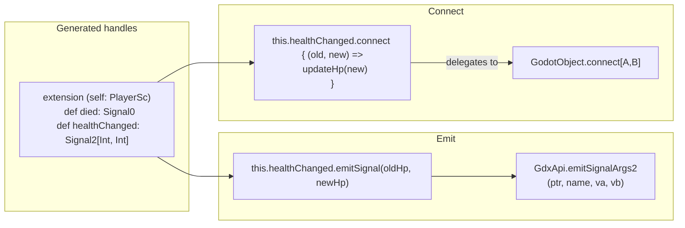

# CallbackRegistry, Signal Connection, and ConnectionToken

Signal connections route through a trampoline-based `CallbackRegistry` that maps
integer IDs to Scala closures. Godot calls the trampoline C function pointer, which
looks up the closure by ID and invokes it.

## Signal Connection Flow



## Two Leaks

### Leak 1: Unbounded `callbacks` Map Growth

Entries are **never removed** from `callbacks`. Even after `disconnect`, the callback
closure and its ID remain in the map:



### Leak 2: Orphaned ConnectionToken

If the user drops the `ConnectionToken` without calling `disconnect`:



## `CallableLambda` — The Same Pattern

`CallableLambda` wraps Scala closures as Godot `Callable` objects for engine APIs that
expect a raw `Callable` argument (e.g., `Tween.tweenCallback`):



These callbacks also leak in the registry map.

## Thread Safety Issues

| Data structure | Access pattern | Problem |
|---------------|---------------|---------|
| `callbacks: mutable.Map[Int, AnyCallback]` | read (trampoline) + write (register) | No synchronization |
| `nextId: Int` | `nextId += 1` — read-modify-write | Data race — two Godot threads can get same ID |

## ConnectionToken

```scala
final class ConnectionToken private[core] (
    val signal: String,
    private[core] val udBuf: Ptr[Byte]  // heap-allocated, freed in disconnect
)
```

`disconnect` frees `udBuf` but does not remove the callback from `CallbackRegistry`:

```scala
// GodotObject.scala:414-416
def disconnect(token: ConnectionToken): Unit =
    GdxApi.disconnectSignal(ptr, token.signal, token.udBuf)
    free(token.udBuf)  // frees the 4-byte buffer
    // MISSING: CallbackRegistry.remove(token.id)
```

## Typed Signal Handles (Signal0-Signal8)

Generated signal handles provide type-safe emission and connection:



## Files

- `gdext/core/src/com/julian-avar/gdext/core/GdxApi.scala:182-185` — `CallbackRegistry` (map + nextId)
- `gdext/core/src/com/julian-avar/gdext/core/GodotObject.scala` — `connect` overloads, `disconnect`, `ConnectionToken`
- `gdext/core/src/com/julian-avar/gdext/core/SignalHandles.scala` — `Signal0` through `Signal8`
- `gdext/core/src/com/julian-avar/gdext/core/Callables.scala` — `CallableLambda` factory
