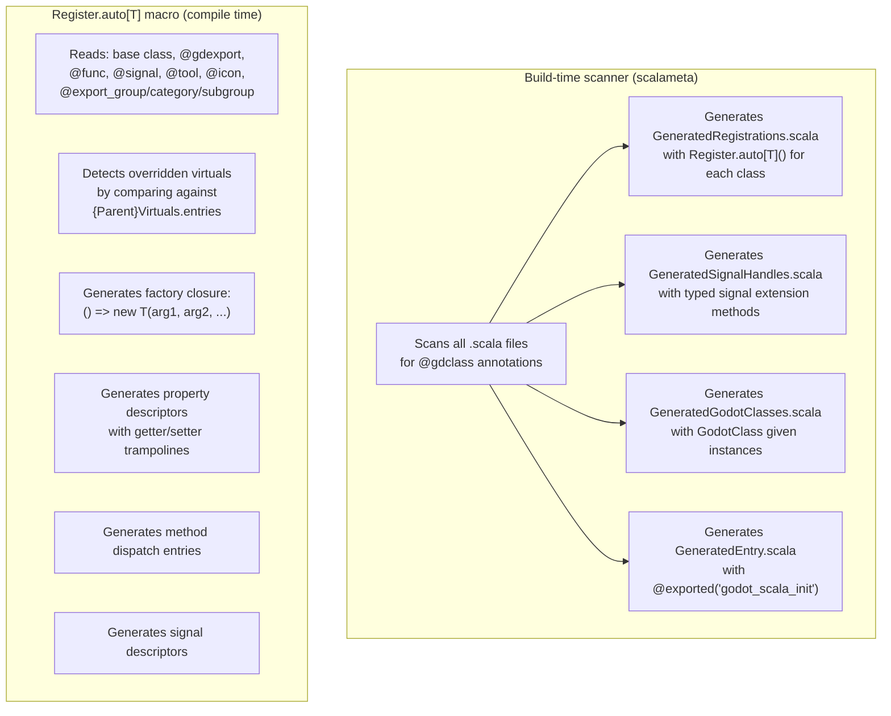
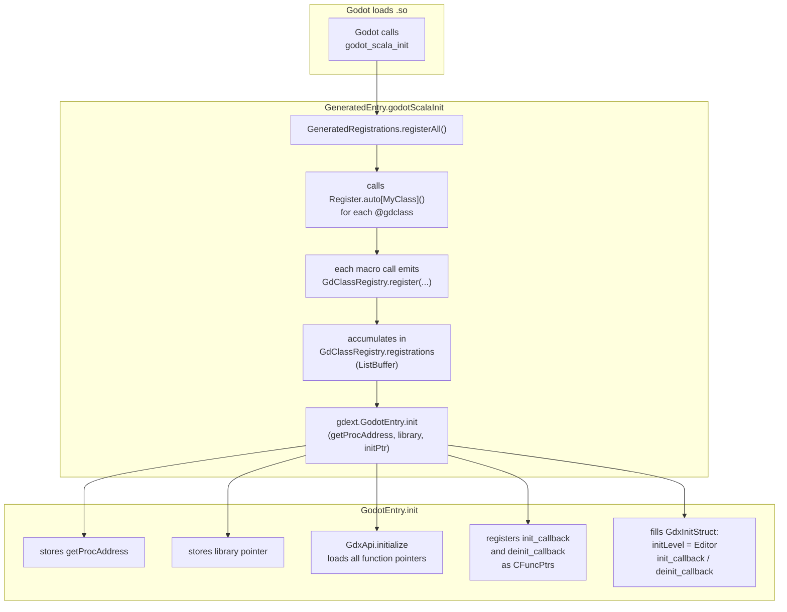
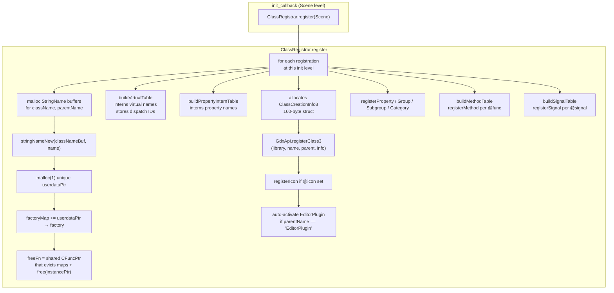
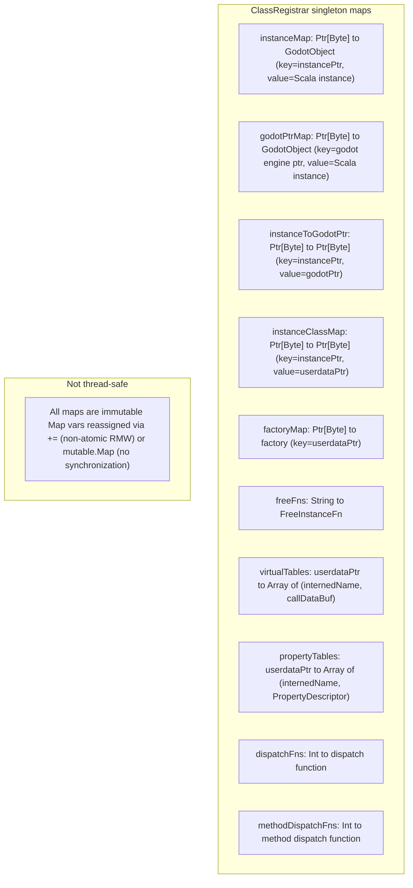
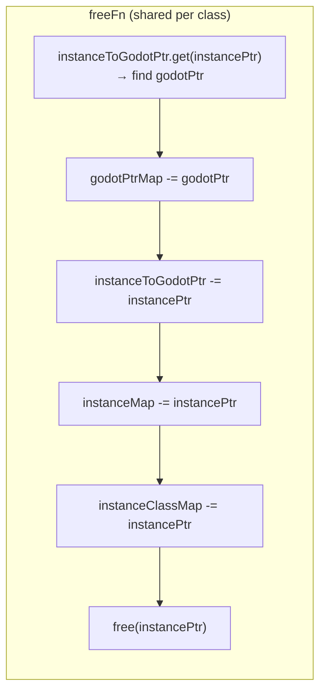

# Class Registration Lifecycle

User-defined Godot classes are registered via a multi-stage process that spans compile
time (macros, build-time scanner) and run time (init callbacks).

## Stage 1: Compile-Time — Macro Expansion

## Stage 2: Init — C Entry Point

## Stage 3: Godot Calls `init_callback(Scene)`

## Instance Maps (Runtime State)

## Free Callback

When Godot destroys an instance (or on hot-reload), it calls the registered
`free_instance_func`:

Note: The Scala `GodotObject` subclass instance is **not** freed here — the Scala GC manages
it. Only the 1-byte `instancePtr` sentinel (malloc'd in `create_instance_func`) is freed.

## Files

- `gdext/core/src/gdext/core/ClassRegistrar.scala` — all maps, create/recreate/free, virtual/property/method dispatch
- `gdext/core/src/gdext/core/GdClassRegistry.scala` — `GdClassRegistration` case class, `ListBuffer`
- `gdext/core/src/gdext/core/Register.scala` — `Register.auto[T]` macro
- `gdext/core/src/gdext/core/GodotEntry.scala` — `init` function, init/deinit callbacks
- `build.mill` — `generatedSources` task (build-time scanner)
