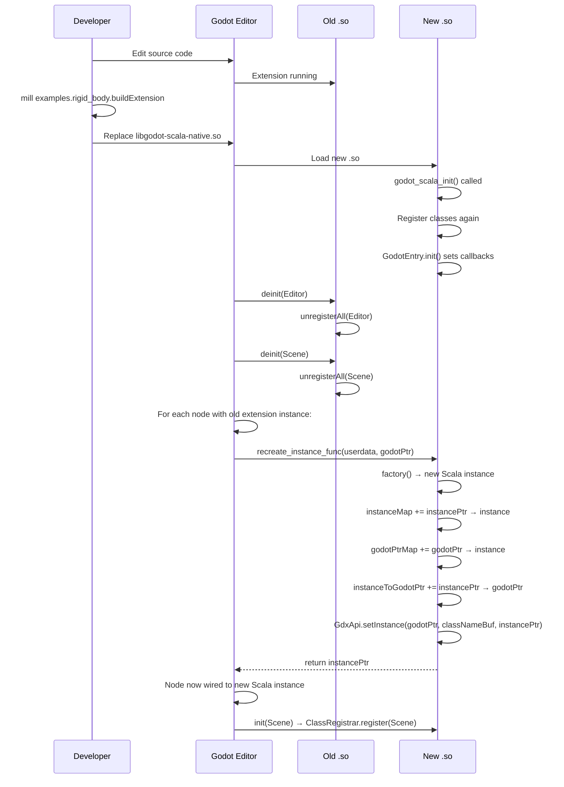
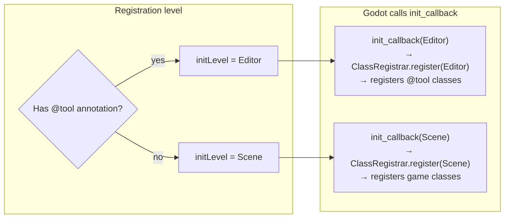
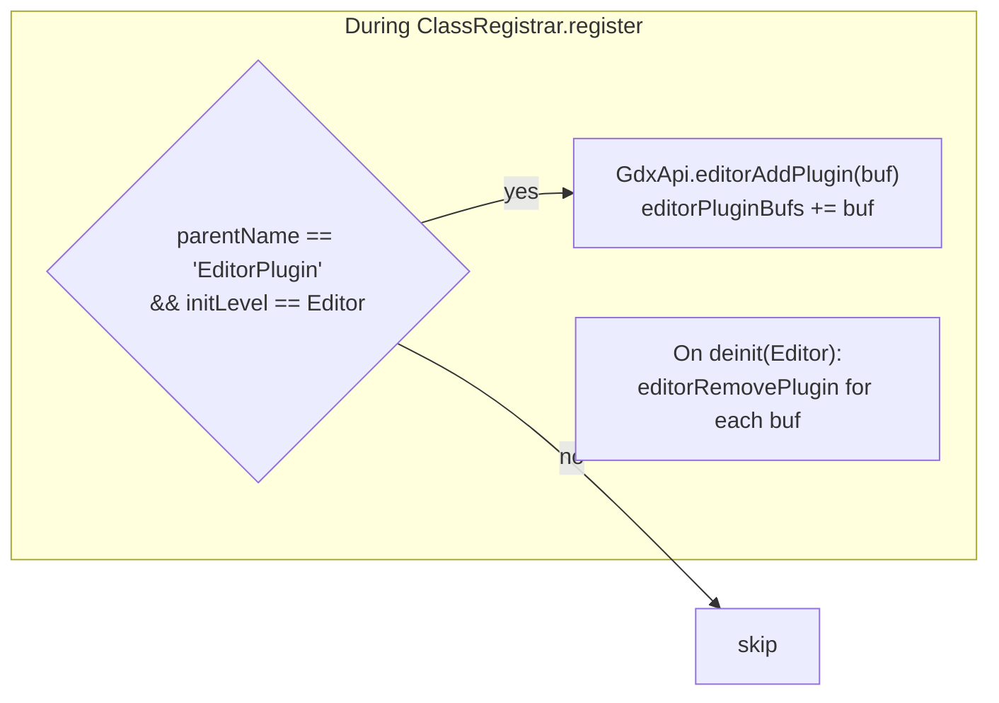
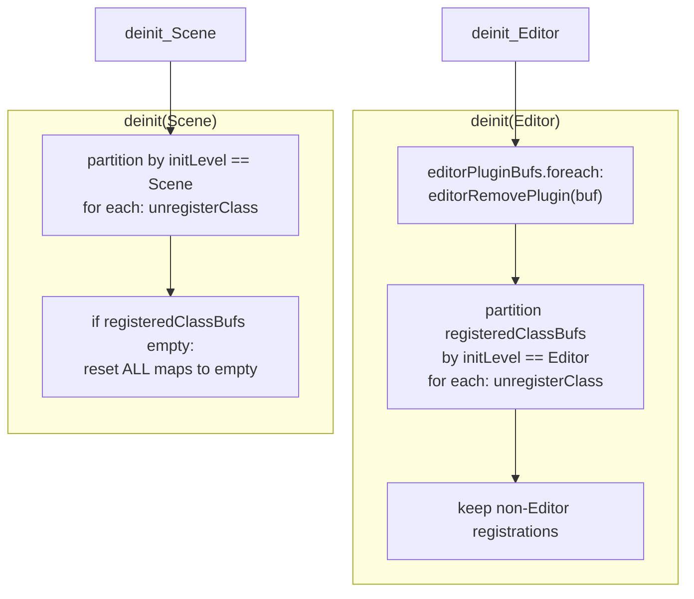

# Hot-Reload Lifecycle

Godot 4.3+ supports `ClassCreationInfo3` with an `is_runtime` flag and a
`recreate_instance_func` callback. This enables recompiling the `.so` and swapping it
at runtime without restarting the editor.

## Hot-Reload Sequence



## is_runtime Flag

| Class type | `is_runtime` | Effect |
|-----------|-------------|--------|
| Node subclass | `true` | Editor treats as placeholder — no `_ready`/`_process` while editing |
| Resource subclass | `false` | Real instance required in editor |
| Object subclass | `false` | Real instance required in editor |
| `@tool` class | `false` | Must run in editor unconditionally |

## Init Level Selection



## EditorPlugin Auto-Activation

Classes whose parent is `EditorPlugin` are automatically activated:



## Unregistration on Deinit



## Known Race Condition

On hot-reload, Godot may call the old `.so`'s `deinit` after the new `.so`'s `init`
has started registering classes. The `unregisterAll` checks `getClassTag` before
unregistering to guard against double-unregistration:

```scala
// ClassRegistrar.scala:109
if GdxApi.getClassTag(buf) != null then GdxApi.unregisterClass(gdxLibrary, buf)
```

## Files

- `gdext/core/src/gdext/core/GodotEntry.scala` — init/deinit callbacks with level dispatch
- `gdext/core/src/gdext/core/ClassRegistrar.scala` — `register(level)`, `unregisterAll(level)`, `recreateFn`
- `gdext/core/src/gdext/core/Register.scala` — `isTool`, `isRuntime`, `initLevel` macro logic
