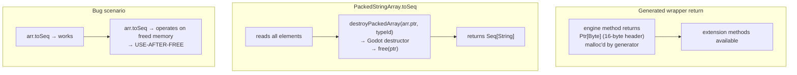
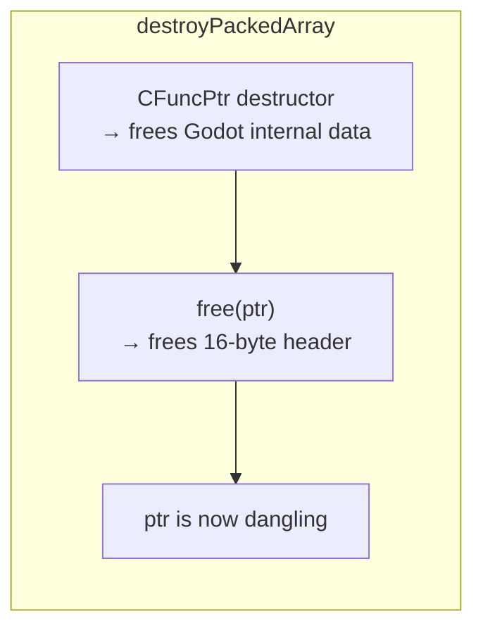

# PackedArrays — Destructor-in-Getter Double-Free

Godot's `Packed*Array` types (`PackedByteArray`, `PackedInt32Array`, etc.) are reference-counted
types returned by value from engine methods. The generated wrappers `malloc` a 16-byte header
for each returned array, and the user must free it.

## The Bug: Destructor in `toSeq`





## The Pattern

Every `toSeq`/`toArray` method calls `destroyPackedArray` after reading:

```scala
// PackedArrays.scala:60-67  (PackedStringArray)
def toSeq: Seq[String] =
    val n   = a.size
    val buf = new Array[String](n)
    var i   = 0
    while i < n do buf(i) = a.apply(i); i += 1
    destroyPackedArray(a.ptr, VT_PACKED_STRING)  // 🐛 frees the handle
    buf.toSeq
```

Same pattern in all 10 packed array types. This means the `extension (a: PackedStringArray)`
methods consume ownership on first call — calling any method after `toSeq`/`toArray` is UB.

## The Two Ownership Models of Packed Arrays

| Source | Ownership | Should you call `destroy`? |
|--------|-----------|--------------------------|
| Returned by generated engine method | Caller owns (malloc'd by wrapper) | Yes |
| Received via `FromVariant` from a Variant | Depends on variant lifecycle | Only if owned |
| Returned from `GdDict.keys()` / `values()` | Malloc'd by dict method | Yes (but leaked if not) |

## Fix Options

1. **Remove destructor from `toSeq`/`toArray`** — make the user call `destroy()` explicitly,
   matching the `GdArray`/`GdDict` pattern
2. **Make `toSeq`/`toArray` consume `this`** — take the extension receiver by value, so the
   compiler prevents reuse
3. **Track ownership** — add an `owned` flag to the packed array wrapper

## Files

- `gdext.core`'s `PackedArrays.scala` — all 10 packed array extension methods, emitted at compile time by `CoreGeneratorModule` (not checked into `src/`)
