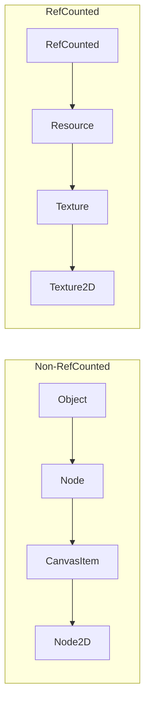
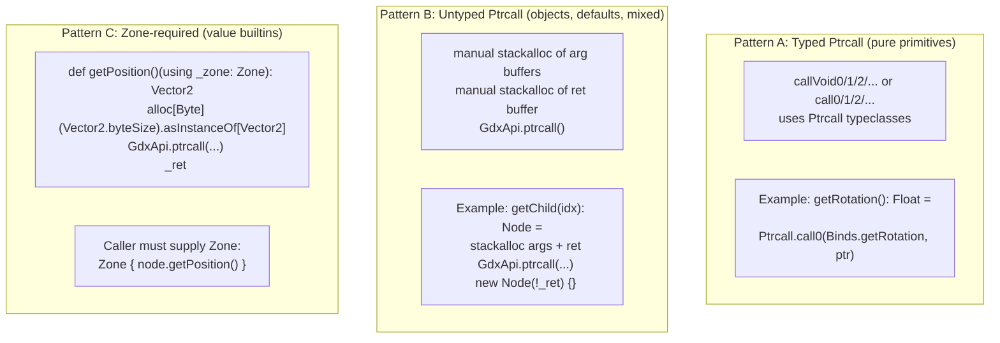
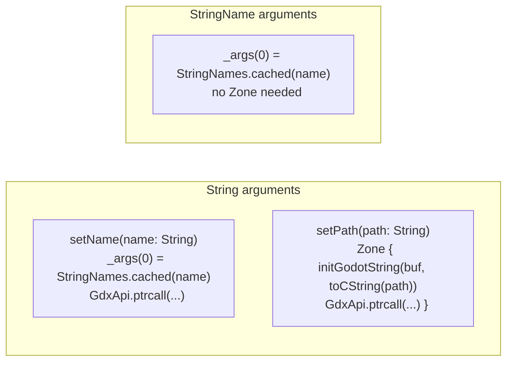
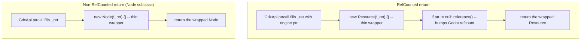
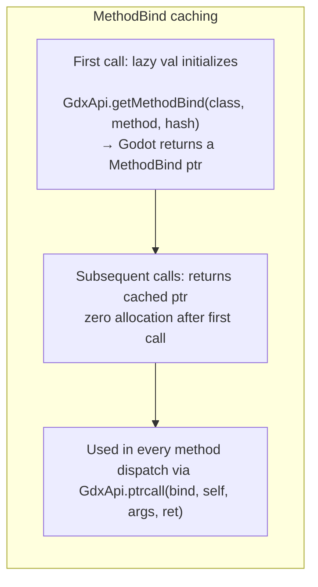
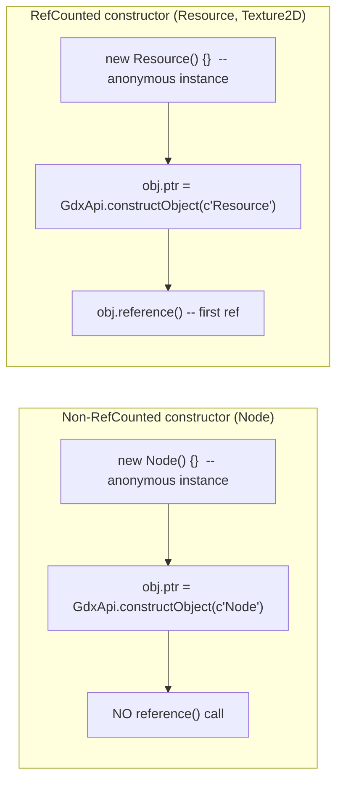

# Generated Engine Class Wrappers — Memory & Dispatch Patterns

The generator (`APIGeneratorModule`, in `gdext/generator-module-mill-plugin/`) reads Godot's
`extension_api.json` at compile time and produces **1 036 engine class wrappers**, compiled
straight into `gdext.api`'s `classes/` package (no checked-in source — regenerated on every
build). Each wrapper provides typed Scala methods for every Godot method, cached method binds,
and a `GodotClass[T]` given for generic handling.

## Class Hierarchy

Every generated class mirrors Godot's inheritance:

```
Object
  ├── RefCounted               ← isRefCounted = true
  │    ├── Resource
  │    │    ├── Texture
  │    │    │    └── Texture2D
  │    │    ├── Mesh
  │    │    └── ...
  │    └── ...
  └── Node                     ← isRefCounted = false
       ├── CanvasItem
       │    └── Node2D
       ├── Node3D
       └── ...
```



## File Anatomy

Every generated class file has five sections:

### 1. Virtual Stubs

```scala
// Node.scala:13-26
abstract class Node(_p: Ptr[Byte] = null) extends Object(_p) {
    override def process(delta: Double): Unit = ()
    override def physicsProcess(delta: Double): Unit = ()
    def enterTree(): Unit = ()
    def exitTree(): Unit = ()
    // ...
}
```

All virtuals have default no-op stubs, and are plain public methods — no `protected[gdext]`
tier like earlier versions of this scheme used. The rare "paired" virtual — one whose
underscore-prefixed name is kept because it collides with an existing public method (e.g.
Control's `_getMinimumSize()` vs. its own public `getMinimumSize()`) — additionally
requires a `(using CanCallApi)` parameter list, so calling it directly from outside the
`gdext` package tree is a compile error rather than just a naming convention (see
`CanCallApi` in `gdext.core`).

The `Register.auto[T]` macro detects which ones the
user overrides and only registers those with Godot. Virtual dispatch wraps each call in
a Zone automatically (see 05-zone-system.md).

### 2. Methods — Three Dispatch Patterns



#### Pattern A — Typed Ptrcall

Used when all arguments and return are primitive (`bool`, `int`, `float`, enums) and
no argument has a default value. Max 6 args.

```scala
// RefCounted.scala:13-16
def initRef(): Boolean     = Ptrcall.call0(RefCounted.Binds.initRef, ptr)
def reference(): Boolean   = Ptrcall.call0(RefCounted.Binds.reference, ptr)
def unreference(): Boolean = Ptrcall.call0(RefCounted.Binds.unreference, ptr)
def getReferenceCount(): Int = Ptrcall.call0(RefCounted.Binds.getReferenceCount, ptr)

// Node2D.scala:18-19
def setRotation(radians: Float): Unit = Ptrcall.callVoid1(Node2D.Binds.setRotation, ptr, radians)
```

Internally uses `stackalloc` for arg and ret buffers, `PtrArg`/`PtrRet` typeclasses to
marshal values. No runtime GC allocation.

#### Pattern B — Untyped Ptrcall

Used when any argument is an object pointer, there are default arguments, or the return
is an engine object. The generator emits manual `stackalloc` calls for each buffer.

```scala
// Node.scala:88-99
def getChild(idx: Int): Node = {
    val _args = stackalloc[Ptr[Byte]](2)
    val _a0   = stackalloc[Long]()
    _a0(0L) = idx.toLong
    _args(0) = _a0.asInstanceOf[Ptr[Byte]]
    val _a1 = stackalloc[Byte]()
    _a1(0L) = 0.toByte
    _args(1) = _a1.asInstanceOf[Ptr[Byte]]
    val _ret = stackalloc[Ptr[Byte]]()
    GdxApi.ptrcall(Node.Binds.getChild, ptr, _args, _ret.asInstanceOf[Ptr[Byte]])
    new Node(!_ret) {}
}
```

The returned `Node` object wraps the raw engine pointer. It is a **thin wrapper** —
no heap allocation beyond the pointer value in `_ret` (which is on the stack).

#### Pattern C — Zone-Required Value Type Returns

When the return type is a value builtin (Vector2, Color, etc.), the method requires
a `using Zone` and uses `alloc[Byte]` (Zone-allocated, not stackalloc):

```scala
// Node2D.scala:27-32
def getPosition()(using _zone: Zone): Vector2 = {
    val _args = null.asInstanceOf[Ptr[Ptr[Byte]]]
    val _ret  = alloc[Byte](Vector2.byteSize).asInstanceOf[Vector2]
    GdxApi.ptrcall(Node2D.Binds.getPosition, ptr, _args, _ret.asInstanceOf[Ptr[Byte]])
    _ret
}
```

The `Zone` guarantees the return buffer lives at least as long as the Zone block.

### 3. String / StringName Argument Handling



| Arg type | Generated pattern | Allocation |
|----------|------------------|------------|
| `String` param | `StringNames.cached(name)` if engine expects `StringName` | None (lookup in process-lifetime cache) |
| `String` param to Godot string | `stackalloc[Byte](8)` + `initGodotString` inside `Zone` | Stack, freed when Zone exits |
| `StringName` param | `StringNames.cached(name)` | None (cache hit or miss → interned) |

### 4. RefCounted Return Wrapping

Methods that return RefCounted subtypes have an **extra `reference()` call** after
construction:

```scala
// Resource.scala:108-120
def duplicate(): Resource = {
    ...
    val _ret = stackalloc[Ptr[Byte]]()
    GdxApi.ptrcall(Resource.Binds.duplicate, ptr, _args, _ret.asInstanceOf[Ptr[Byte]])
    {
        val _r = new Resource(!_ret) {}
        if (_r.ptr != null) _r.reference()   // ← RefCounted: bump refcount
        _r
    }
}

// Texture2D.scala:94-103
def getImage(): Image = {
    ...
    {
        val _r = new Image(!_ret) {}
        if (_r.ptr != null) _r.reference()   // ← RefCounted: bump refcount
        _r
    }
}
```



**Why `reference()` is needed:** Godot's engine method returns the object with the
refcount already incremented once for the caller. Without the additional `reference()`,
the Scala wrapper would hold a pointer that could be invalidated if the engine drops
its reference. The extra `reference()` ensures the Scala wrapper has its own reference,
which the user releases via `.unref()` or `AutoCloseable`.

### 5. Companion Object — Method Binds

```scala
// Node.scala companion (at end of file):
object Node {
    object Binds {
        lazy val addSibling: Ptr[Byte] = GdxApi.getMethodBind(c"Node", c"add_sibling", 2992563528L)
        lazy val setName: Ptr[Byte]    = GdxApi.getMethodBind(c"Node", c"set_name", 83702148L)
        lazy val getName: Ptr[Byte]    = GdxApi.getMethodBind(c"Node", c"get_name", 201670096L)
        // ... ~80 entries for Node
    }
    // ...
}
```



`GdxApi.getMethodBind` calls `classdb_get_method_bind` from Godot's C API. The result
is cached in a `StringNames`-keyed map in `GdxApi` (process lifetime). The `lazy val`
in `Binds` ensures each bind is fetched **at most once**, on first use.

### 6. Companion `apply` — Constructor



```scala
// Resource.scala:189-194
def apply: Resource = {
    val obj = new Resource() {}
    obj.ptr = GdxApi.constructObject(c"Resource")
    obj.reference()                        // ← first reference
    obj
}
```

### 7. GodotClass Given

```scala
// Resource.scala:201-205
given GodotClass[Resource] = new GodotClass[Resource] {
    def className    = "Resource"
    def isRefCounted = true               // ← used by Gd[T] for free/unref dispatch
    def wrap(p: Ptr[Byte]) = new Resource(p) {}
}
```

Used by:
- `Gd[T]` — determines `free()` vs `unref()` behavior
- `Gd.cast[U]` — typed downcast
- `GodotObject.as[T]` — unsafe downcast
- `ClassRegistrar` — identity preservation

## Memory Footprint per Call

| Operation | Stack allocation | Heap allocation | GC allocation |
|-----------|-----------------|----------------|---------------|
| Primitive getter (getRotation) | `stackalloc[Double]` (8B) | 0 | 0 |
| Object getter (getChild) | `stackalloc[Ptr[Byte]]` + arg bufs (~48B) | 0 | 0 |
| Value-type getter (getPosition) | `alloc[Byte]` in Zone (~8-64B) | 0 | 0 |
| String arg (Zone path) | `stackalloc[Byte](8)` + CString in Zone | 0 | 0 |
| StringName arg | 0 | 0 | 0 (cache) |
| RefCounted return wrapper | `stackalloc[Ptr[Byte]]` (8B) | 0 | Thin anonymous class |
| Non-RefCounted return wrapper | `stackalloc[Ptr[Byte]]` (8B) | 0 | Thin anonymous class |

**No heap allocation for any ptrcall argument or return buffer.** All buffers are
`stackalloc`'d or Zone-allocated. The only heap allocation is the anonymous class
instance wrapping the returned engine pointer (a single object header, negligible).

## Property Getter Footgun

The generated property getter style uses `stackalloc` instead of Zone allocation:

```scala
// Node2D.scala (generated, property getter section)
def position: Vector2 = {
    val _ret = stackalloc[Byte](Vector2.byteSize).asInstanceOf[Vector2]
    GdxApi.ptrcall(...)
    _ret
}
```

The docstring warns that the returned value is only valid for the current frame
because `stackalloc` is freed when the method returns. Users must call
`getPosition()(using Zone)` (the explicit Zone form) to get a stable copy.

This is a **documented footgun**, not a classic use-after-free, because `stackalloc`
returns a pointer to the *caller's* stack frame — it's valid until the enclosing
function returns. But storing it in a field or across frames is UB.

## Files

- `gdext.api`'s `classes/*.scala` — 1 036 class wrappers, produced at compile time (not checked into `src/`)
- `gdext/generator-module-mill-plugin/src/com/julian-avar/gdext/godotscalanativelib/api/generators/WrappersGenerator.scala` — generates them
- `gdext/generator-module-mill-plugin/src/com/julian-avar/gdext/godotscalanativelib/utils.scala` — shared helpers (dispatch, type mapping)
- `gdext/core/src/com/julian-avar/gdext/core/Ptrcall.scala` — typed ptrcall dispatchers
- `gdext/core/src/com/julian-avar/gdext/core/GdxApi.scala` — `getMethodBind`, `ptrcall`, `constructObject`
