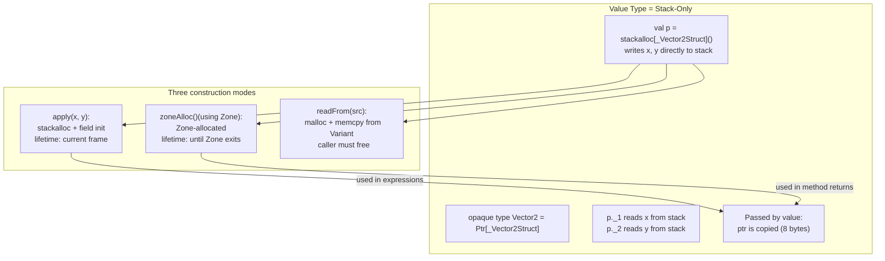
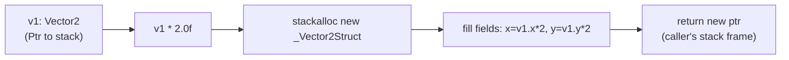
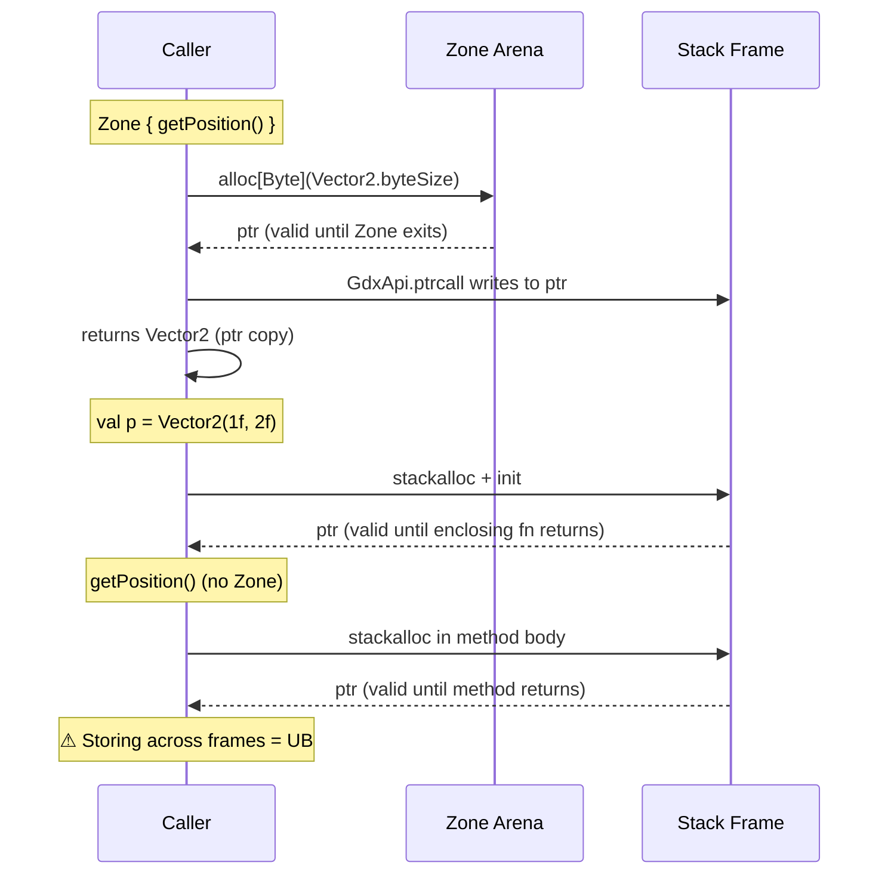

# Generated Value Types — Opaque Pointers Over C Structs

All 16 Godot value-type builtins are generated at compile time (`BuiltinsGenerator`, part of
`APIGeneratorModule`) into `gdext.api`'s `GodotBuiltins.scala` as **opaque type aliases** over
pointers to `CStructN` types. They exist only on the stack — no heap allocation, no GC tracking.

## The 16 Types

| Type | C Struct | Fields | Size (bytes) |
|------|----------|--------|-------------|
| `Vector2` | `CStruct2[Float, Float]` | x, y | 8 |
| `Vector2i` | `CStruct2[Int, Int]` | x, y | 8 |
| `Vector3` | `CStruct3[Float, Float, Float]` | x, y, z | 12 |
| `Vector3i` | `CStruct3[Int, Int, Int]` | x, y, z | 12 |
| `Vector4` | `CStruct4[Float, Float, Float, Float]` | x, y, z, w | 16 |
| `Vector4i` | `CStruct4[Int, Int, Int, Int]` | x, y, z, w | 16 |
| `Color` | `CStruct4[Float, Float, Float, Float]` | r, g, b, a | 16 |
| `Rect2` | `CStruct2[Vector2, Vector2]` | position, size | 16 |
| `Rect2i` | `CStruct2[Vector2i, Vector2i]` | position, size | 16 |
| `Transform2D` | `CStruct3[Vector2, Vector2, Vector2]` | x, y, origin | 24 |
| `Plane` | `CStruct2[Vector3, Float]` | normal, d | 16 |
| `Quaternion` | `CStruct4[Float, Float, Float, Float]` | x, y, z, w | 16 |
| `AABB` | `CStruct2[Vector3, Vector3]` | position, size | 24 |
| `Basis` | `CStruct3[Vector3, Vector3, Vector3]` | x, y, z | 36 |
| `Transform3D` | `CStruct2[Basis, Vector3]` | basis, origin | 48 |
| `Projection` | `CStruct4[Vector4, Vector4, Vector4, Vector4]` | columns | 64 |

## Memory Model



## Generated Structure

```scala
// GodotBuiltins.scala:7-63 (simplified)
private type _Vector2Struct     = CStruct2[Float, Float]
opaque type Vector2             = Ptr[_Vector2Struct]

object Vector2 {
    val byteSize: CSize = sizeof[_Vector2Struct]

    // Stack-allocated constructor — valid only in current frame
    inline def apply(x: Float, y: Float): Vector2 = {
        val p = stackalloc[_Vector2Struct]()
        p._1 = x
        p._2 = y
        p
    }

    // Zone-allocated constructor — valid until Zone exits
    def zoneAlloc()(using Zone): Vector2 =
        scala.scalanative.unsafe.alloc[_Vector2Struct]()

    // Variant marshalling
    def writeTo(dest: Ptr[Byte], value: Vector2): Unit = Variant.writeBuiltin(5, dest, value)
    def readFrom(src: Ptr[Byte]): Vector2              = Variant.readBuiltin[_Vector2Struct](src)

    // Operators — all inline stackalloc
    extension (v: Vector2) {
        inline def x: Float                        = v._1
        inline def x_=(value: Float): Unit         = v._1 = value
        inline def map(f: Float => Float): Vector2 = {
            val result = stackalloc[_Vector2Struct]()
            result.x = f(v.x)
            result.y = f(v.y)
            result
        }
        inline def *(scalar: Float): Vector2 = v.map(_ * scalar)
        inline def +(o: Vector2): Vector2    = v.combine(o)(_ + _)
        // ...
    }
}
```

## Operator Pattern

Every operator returns a **new stack-allocated value**, never mutating `this`:



All operators are `inline`, so at the call site the `stackalloc` and field writes
are inlined directly — zero function call overhead.

## Composite Types

Types with struct-typed fields (e.g., `Rect2[Vector2, Vector2]`) do **not** get
an `apply` constructor — only `at1`, `at2` field accessors:

```scala
private type _Rect2Struct = CStruct2[_Vector2Struct, _Vector2Struct]
opaque type Rect2         = Ptr[_Rect2Struct]

object Rect2 {
    extension (v: Rect2) {
        inline def position: Vector2 = v.at1   // reads the first Vector2 field
        inline def size: Vector2     = v.at2   // reads the second Vector2 field
    }
}
```

## Zone vs Stack Lifetime



## Heap Type Builtins (Hand-Written)

Types like `RID`, `Callable`, `NodePath`, and `StringName` are **not generated** as
value types — they are hand-written heap-allocated wrappers:

| Type | Wrapper | Storage | Free |
|------|---------|---------|------|
| `RID` | `class RID(val ptr: Ptr[Byte])` | Heap (malloc) | `destroy()` or GC |
| `NodePath` | `class NodePath(val handle: Ptr[Byte])` | Heap (8B handle) | `destroy()` |
| `StringName` | `class StringName(val handle: Ptr[Byte])` | Heap (8B handle) | `destroy()` |
| `Callable` | `class Callable(val ptr: Ptr[Byte])` | Heap (16B) | `destroy()` |

These occupy the middle ground between value types and engine classes — they are
opaque 8-16 byte handles that Godot's C API manages by pointer, but they are not
`GodotObject` subclasses.

## Files

- `gdext.api`'s `GodotBuiltins.scala` — all 16 value types (600 lines), produced at compile time (not checked into `src/`)
- `gdext/core/src/com/julian-avar/gdext/core/generated/NodePath.scala` — heap type, emitted at compile time by `CoreGeneratorModule`
- `gdext/core/src/com/julian-avar/gdext/core/generated/StringName.scala` — heap type, emitted at compile time by `CoreGeneratorModule`
- `gdext/core/src/com/julian-avar/gdext/core/PropertyDescriptor.scala` — `Variant.readBuiltin`/`writeBuiltin`
- `BuiltinExtensions.scala` (constants, `distanceTo`, etc.) is **not yet implemented** — see `FEATURES.md#known-limitations`
