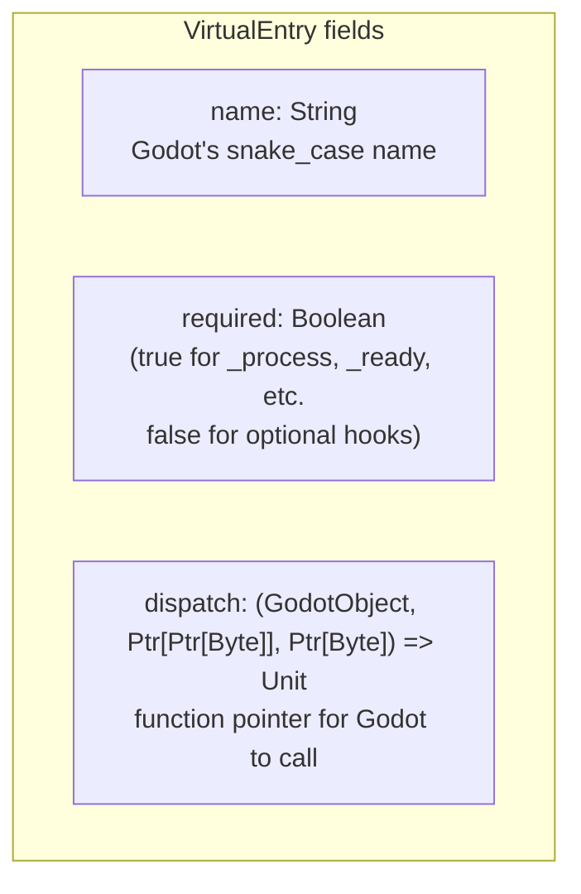
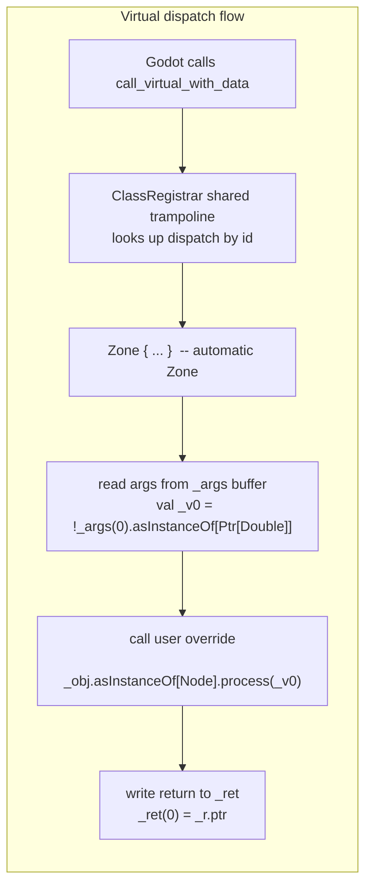
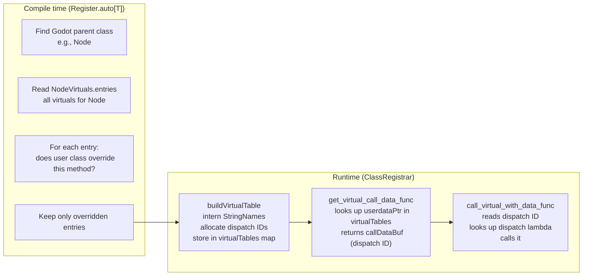
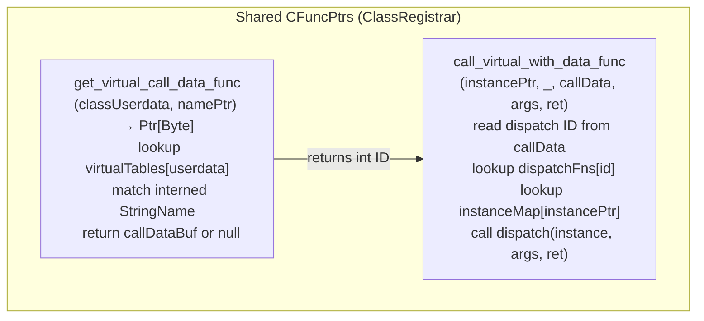

# Generated Virtual Dispatch Tables

Every Godot engine class that has virtual methods gets a corresponding `{Class}Virtuals.scala`
file, produced at compile time (`VirtualsGenerator`, part of `APIGeneratorModule`) into `gdext.api`'s
`virtuals/` package. These tables list every overridable virtual method with its name, a `required`
flag, and a dispatch lambda.

## Structure

```scala
// virtuals/NodeVirtuals.scala
object NodeVirtuals {
    val entries: Vector[VirtualEntry] = Vector(
        VirtualEntry("_process", required = false,
            dispatch = (_obj, _args, _ret) => Zone {
                val _v0 = !_args(0).asInstanceOf[Ptr[Double]]
                _obj.asInstanceOf[Node].process(_v0)
            }
        ),
        VirtualEntry("_ready", required = false,
            dispatch = (_obj, _args, _ret) => Zone {
                _obj.asInstanceOf[Node].ready()
            }
        ),
        VirtualEntry("_get_focused_accessibility_element", required = false,
            dispatch = (_obj, _args, _ret) => Zone {
                val _r = _obj.asInstanceOf[Node].getFocusedAccessibilityElement()
                _ret.asInstanceOf[Ptr[Ptr[Byte]]](0L) = if (_r != null) _r.ptr else null
            }
        ),
        // ...
    )
}
```



## Dispatch Lambda Anatomy

Every dispatch lambda follows the same pattern:

1. **Zone wrap** — the entire body is inside `Zone { ... }` so any Zone-requiring
   method called from the override works without explicit Zone blocks
2. **Arg unmarshal** — reads values from `_args(0..N)` typed pointer array
3. **Call the Scala override** — `_obj.asInstanceOf[Node]._overrideName(args...)`
4. **Return marshal** — writes return value into `_ret` buffer (for non-Unit returns)



## Return Value Handling

| Return type | Marshal code |
|-------------|-------------|
| `Unit` (void) | No return write |
| `Boolean` | `_ret(0) = (if _r then 1 else 0).toByte` |
| `Int` | `_ret.asInstanceOf[Ptr[Long]](0L) = _r.toLong` |
| `Float` | `_ret.asInstanceOf[Ptr[Double]](0L) = _r.toDouble` |
| Engine object (Node, etc.) | `_ret.asInstanceOf[Ptr[Ptr[Byte]]](0L) = if _r != null then _r.ptr else null` |
| `RID` | `_ret.asInstanceOf[Ptr[Long]](0L) = if _r != null && _r.ptr != null then !_r.ptr.asInstanceOf[Ptr[Long]] else 0L` |
| PackedStringArray | `_ret(0) = ...` (pointer write, but stub returns `null`) |

## How Register.auto Uses Virtuals

The `Register.auto[T]` macro at compile time:

1. Reads the generated `{ParentClass}Virtuals.entries` for the Godot base class
2. Checks which of those virtuals the user class actually overrides
3. Only registers the overridden ones with Godot



## Inheritance

Virtual tables are **inheritance-aware**. The generator emits the full set of virtuals
for each class, including inherited ones. For example, `Node2D`'s virtuals include
`Node`'s `_process`, `_ready`, etc. plus `CanvasItem`'s `_draw`:

```scala
// NodeVirtuals: _process, _ready, _enter_tree, _exit_tree, _input, ...
// CanvasItemVirtuals: _draw, _hide, ...
// Node2DVirtuals: all of Node + CanvasItem + Node2D-specific
```

The `Register.auto` macro reads the generated `{Class}Virtuals` for the **direct parent
class** of the user's `@gdclass`, which already includes the full ancestor chain.

## Shared CFuncPtr Trampoline

All virtual dispatch routes through **two shared C function pointers** per extension load:



No per-class CFuncPtrs are created — the same two shared trampolines handle all
classes. The `classUserdata` pointer (unique per registered class) selects the
correct virtual table.

## Files

- `gdext.api`'s `virtuals/*Virtuals.scala` — 1 036 virtual tables, produced at compile time (not checked into `src/`)
- `gdext/generator-module-mill-plugin/src/com/julianavar/gdext/godotscalanativelib/api/generators/VirtualsGenerator.scala` — generates them
- `gdext/generator-module-mill-plugin/src/com/julianavar/gdext/godotscalanativelib/utils.scala` — shared tree-building helpers
- `gdext/core/src/com/julianavar/gdext/core/ClassRegistrar.scala` — `virtualTables`, `dispatchFns`, `buildVirtualTable`
- `gdext/core/src/com/julianavar/gdext/core/Register.scala` — `auto[T]` macro filtering virtuals
- `gdext/core/src/com/julianavar/gdext/core/virtual/VirtualEntry.scala` — case class
